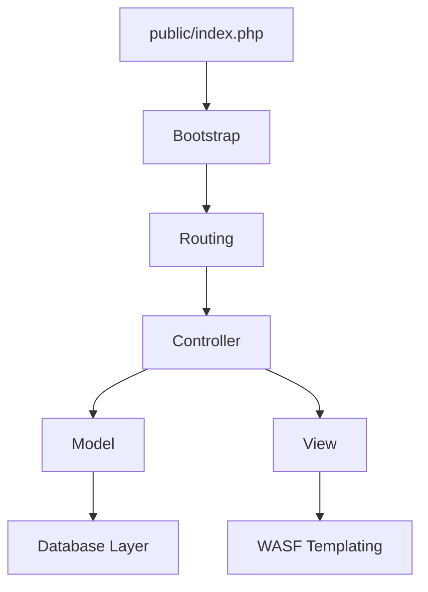

# WASF PHP Framework — Extended Edition 🚀


---

# 📸 Screenshot


---

# 🧬 Arsitektur WASF (Diagram)



---

# ✨ Fitur Utama

* Super Lightweight & Fast  
* HMVC Modular Architecture  
* Blade Templating Engine  
* WASF Console Commands  
* PDO Database Wrapper  
* .env Loader & Config Manager  
* PSR-4 Autoloading  
* Extendable & Clean Structure  

---

# ⚡ Instalasi

## Opsi 1 — WASF Installer (Rekomendasi)

Install installer:

```bash
composer global require wasframework/wasf-installer
```

Buat project baru:

```bash
wasf new myproject
cd myproject
```

## Opsi 2 — Composer

```bash
composer create-project wasframework/wasf-app myproject
cd myproject
```

---

# 🔑 Setup Aplikasi

```bash
cp .env.example .env
php wasf key:generate
```

## Jalankan Server

```bash
php wasf serve
```

Akses:  
`http://localhost:8000`

---

# 🧱 Struktur Direktori

```txt
app/
 ├─ Controllers/
 ├─ Models/
 └─ Views/
Modules/
routes/
public/
storage/
```

---

# 🧪 Migration Example

```php
<?php

use Wasf\Database\Schema;

return new class {
    public function up()
    {
        Schema::create("users", function($t){
            $t->id();
            $t->string("name");
            $t->string("username")->unique();
            $t->string("email")->unique();
            $t->string("password");
            $t->string("photo")->default("/uploads/profile/default.png");
            $t->timestamps();
        });
    }

    public function down()
    {
        Schema::dropIfExists("users");
    }
};
```

---

# 🔧 CLI Commands

```bash
php wasf make:controller UserController
php wasf make:model User
php wasf make:migration create_users_table
php wasf migrate
php wasf route:list
php wasf clear:view
```

---

# 🛡 Keamanan

Laporkan masalah keamanan ke:
Kontak: **wasuryanto3@gmail.com**

---

# 📄 Lisensi

MIT License
